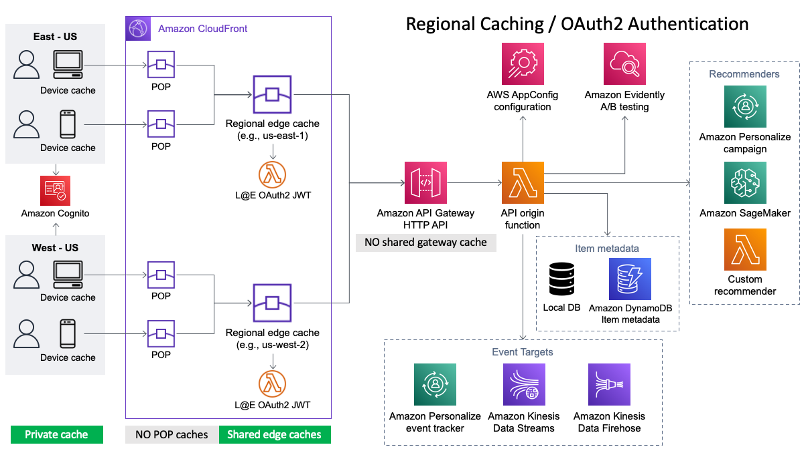
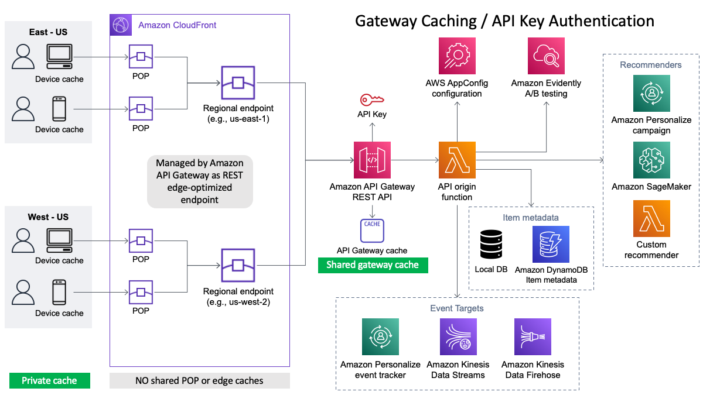

# Personalization APIs Authentication

There are three authentication schemes supported by the Personalization APIs solution.

- **OAuth2 edge (Amazon Cognito)**: requests from your client application(s) to the Personalization APIs must include a JWT token provided by Amazon Cognito in the `Authorization` request header
- **API Key**: requests from your client applications to the Personalization APIs must include an Amazon API Gateway API Key in the `X-Api-Key` request header
- **None**: requests from your client applications to the Personalization APIs require no authentication (**this also means anyone can call your APIs as well!**)

You select your desired authentication scheme when deploying the Personalization APIs solution. Changing your scheme requires redeploying the solution with a different authentication scheme option. The sections below go into more detail on each scheme.

## OAuth2 edge authentication

**You must deploy the Personalization APIs with an Authentication Scheme of `OAuth2-Cognito` to use this authentication method AND you must deploy the edge authentication resources (see the installation instructions).**



For testing purposes, you can create a JWT token from Cognito for an existing user in the Cognito user pool using the following command.

```bash
aws cognito-idp initiate-auth \
    --client-id [YOUR_USER_POOL_CLIENT_APP_ID] \
    --auth-flow USER_PASSWORD_AUTH \
    --auth-parameters USERNAME=[COGNITO_USERNAME],PASSWORD=[COGNITO_USER_PASSWORD] \
    --region [REGION] \
    --query AuthenticationResult.AccessToken \
    --output text
```

Where...

- `[YOUR_USER_POOL_CLIENT_APP_ID]` is the Amazon Cognito user pool client application ID. If you deployed the Personalization APIs with `CreateCognitoResources` set to `Yes`, you can find the client app ID in the `CognitoUserPoolClientId` CloudFormation output parameter. Otherwise, you will need to create a Cognito client app and use its ID.
- `[COGNITO_USERNAME]` is the username for a Cognito user in your Cognito user pool.
- `[COGNITO_USER_PASSWORD]` is the password for the Cognito user identified by `[USERNAME]`.
- `[REGION]` is the region where your Cognito user pool and client are deployed.

The returned value is the token that should be specified in the `Authorization` header as a `Bearer` token. Here is an example of how this would be done using `curl`:

```bash
curl -H "Authorization: Bearer [TOKEN]" https://[HOST]/recommend-items/[NAMESPACE]/[RECOMMENDER/[USER_ID]
```

### Protecting your origin API from direct access

Since authentication is done in CloudFront and not in API Gateway, callers can potentially bypass CloudFront and call API Gateway directly if they know your API Gateway endpoint URL. You can protect the origin API endpoint (API Gateway) using AWS WAF. This will deny requests that attempt to call API Gateway directly. Details [here](https://www.wellarchitectedlabs.com/security/300_labs/300_multilayered_api_security_with_cognito_and_waf/3_prevent_requests_from_accessing_api_directly/).

## API Key authentication

**You must deploy the Personalization APIs with an Authentication Scheme of `ApiKey` to use this authentication method.**

When you deployed the Personaliation APIs, an API Key was automatically created for you. The key name can be found in the `RestApiKey` CloudFormation output parameter value when the solution was deployed or in the AWS console for API Gateway. The API Key value for the key name can be found in the AWS console for API Gateway.



Once you have the API Key value, you use it as the value of the `X-Api-Key` request header when making requests to the Personalization APIs. Here is an example of how this would be done using `curl`.

```bash
curl -H "X-Api-Key: [API-KEY-VALUE]" https://[HOST]/recommend-items/[NAMESPACE]/[RECOMMENDER/[USER_ID]
```

## No authentication

**You must deploy the Personalization APIs with an Authentication Scheme of `None` to use this authentication method.**

There is no authentication required when the authentication scheme is none. **This means that there are no authentication protections deployed with your APIs and anyone that knows your API endpoint URL and path layout can call your APIs.**

This authentication scheme is useful if want to layer your own custom authentication approach, such as an [API Gateway Lambda authorizer](https://docs.aws.amazon.com/apigateway/latest/developerguide/apigateway-use-lambda-authorizer.html), on top of the Personalization APIs after the solution is deployed.


