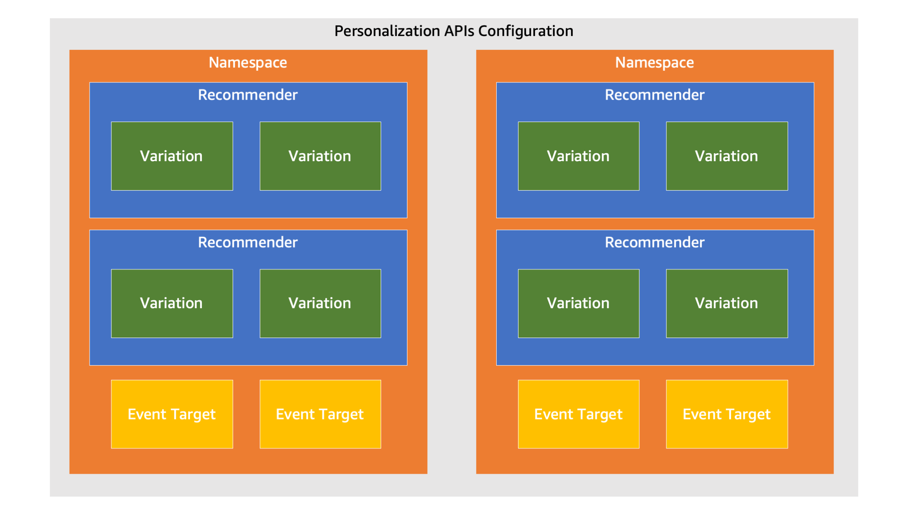
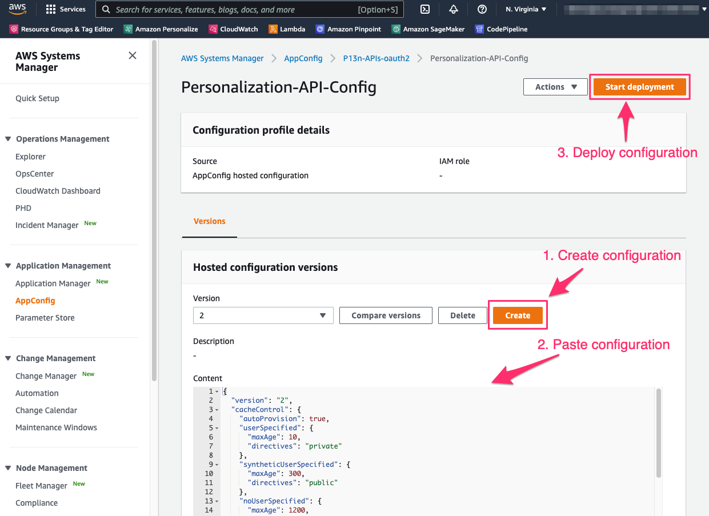

# Personalization APIs Configuration

The Personalization APIs solution operates based on a configuration stored in [AWS AppConfig](https://aws.amazon.com/systems-manager/features/appconfig/). The configuration is specified in a hosted JSON profile in AppConfig and includes all of the settings that control the APIs. Within the configuration you can setup one or more namespaces (analagous to an application, a Personalize domain, or a Personalize custom dataset group).

## Primary concepts

- **Configuration** - there is a single configuration definition that is represented in JSON and stored as a hosted configuration profile in AWS AppConfig. A configuration skeleton is automatically created by the Personalization APIs solution deployment that you can quickly update to match your environment.
- **Namespace** - a logical construct within the configuration that can be used to organize recommenders at an application or dataset group level. One or more namespaces can be defined in the configuration.
- **Recommender** - a logical provider of recommendations for a specific use case within a namespace. One or more recommenders can be defined for a namespace.
- **Variation** - the definition for an actual implementation of a recommender. One or more variations can be defined for a recommender. Multiple variations are used with A/B tests.
- **Event target** - a destination or sink for events/interactions that are streamed to the events entry point for a namespace. One or more event targets can be defined for a namespace.



### Namespace

A logical construct within the configuration that can be used to organize recommenders at an application or dataset group level. One or more namespaces can be defined in the configuration.

Here is an example of a configuration that defines three different applications as separate namespaces. The keys within `namespace` uniquely identify each namespace where the key value is used to map an API request to a namespace. See the [API entry points](./api_entry_points.md) documentation for details on API URI mapping to namespaces and recommenders.

```javascript
{
    "namespaces": {
        "my-app-1": {
        },
        "my-app-2": {
        }
        "my-app-3": {
        }
    }
}
```

### Recommender

A logical provider of recommendations for a specific use case within a namespace. One or more recommenders can be defined for a namespace.

Here is an example of a single namespace configuration for `my-app-1` that has three recommenders defined for all three supported API action types (`recommend-items`, `related-items`, and `rerank-items`). Under each API action type, one or more recommenders can be defined where the key uniquely identifies the recommender within the namespace. You define this key and it is used to map API requests to a recommender. See the [API entry points](./api_entry_points.md) documentation for details on API URI mapping to namespaces and recommenders.

```javascript
{
    "namespaces": {
        "my-app-1": {
            "recommenders": {
                "recommend-items": {
                    "my-recommended-for-you": {
                    }
                },
                "related-items": {
                    "my-similar": {
                    }
                },
                "rerank-items": {
                    "my-personalized-ranking": {
                    }
                }
            }
        }
    }
}
```

### Variation

The definition for an actual implementation of a recommender. One or more variations can be defined for a recommender. Multiple variations are used with A/B tests.

Here is an example of a single namespace configuration for `my-app-1` that has a single `recommend-items` recommender with the key `my-recommended-for-you`. This recommender has a single variation with the key `my-user-personalization` that is a Personalize campaign.

```javascript
{
    "namespaces": {
        "my-app-1": {
            "recommenders": {
                "recommend-items": {
                    "my-recommended-for-you": {
                        "variations": {
                            "my-user-personalization": {
                                "type": "personalize-campaign",
                                "arn": "arn:aws:personalize:[REGION]:[ACCOUNT]:campaign/[CAMPAIGN_NAME]"
                            }
                        }
                    }
                }
            }
        }
    }
}
```

#### Amazon Personalize campaign variation

- `namespaces.{NAMESPACE_KEY}.recommender.{ACTION_TYPE}.{RECOMMENDER_KEY}.variations.{VARIATION_KEY}.type`: Must be `"personalize-campaign"` (required).
- `namespaces.{NAMESPACE_KEY}.recommender.{ACTION_TYPE}.{RECOMMENDER_KEY}.variations.{VARIATION_KEY}.arn`: The Personalize campaign ARN (required).
- `namespaces.{NAMESPACE_KEY}.recommender.{ACTION_TYPE}.{RECOMMENDER_KEY}.variations.{VARIATION_KEY}.filters`: Personalize filters to choose from that are automatically applied for each request (optional). See the documentation on filters below for details.

#### Amazon Personalize recommender variation

- `namespaces.{NAMESPACE_KEY}.recommender.{ACTION_TYPE}.{RECOMMENDER_KEY}.variations.{VARIATION_KEY}.type`: Must be `"personalize-recommender"` (required).
- `namespaces.{NAMESPACE_KEY}.recommender.{ACTION_TYPE}.{RECOMMENDER_KEY}.variations.{VARIATION_KEY}.arn`: The Personalize recommender ARN (required).
- `namespaces.{NAMESPACE_KEY}.recommender.{ACTION_TYPE}.{RECOMMENDER_KEY}.variations.{VARIATION_KEY}.filters`: Personalize filters to choose from that are automatically applied for each request (optional). See the documentation on filters below for details.

#### AWS Lambda function variation

**Experimental/untested**

- `namespaces.{NAMESPACE_KEY}.recommender.{ACTION_TYPE}.{RECOMMENDER_KEY}.variations.{VARIATION_KEY}.type`: Must be `"function"` (required).
- `namespaces.{NAMESPACE_KEY}.recommender.{ACTION_TYPE}.{RECOMMENDER_KEY}.variations.{VARIATION_KEY}.arn`: The AWS Lambda function ARN (required).

#### Amazon SageMaker endpoint variation

**Experimental/untested**

- `namespaces.{NAMESPACE_KEY}.recommender.{ACTION_TYPE}.{RECOMMENDER_KEY}.variations.{VARIATION_KEY}.type`: Must be `"sagemaker"` (required).
- `namespaces.{NAMESPACE_KEY}.recommender.{ACTION_TYPE}.{RECOMMENDER_KEY}.variations.{VARIATION_KEY}.endpointName`: Amazon SageMaker endpoint name (required).

#### A/B testing/experiments

See the [experimentation](./experimentation.md) documentation for details.

#### Filters

An Amazon Personalize filter that should be automatically applied to the `GetRecommendations`/`GetPersonalizedRanking` API call to a Personalize campaign/recommender.

```javascript
{
    "namespaces": {
        "my-app-1": {
            "recommenders": {
                "recommend-items": {
                    "my-recommended-for-you": {
                        "variations": {
                            "my-user-personalization": {
                                "type": "personalize-campaign",
                                "arn": "arn:aws:personalize:[REGION]:[ACCOUNT]:campaign/[CAMPAIGN_NAME]"
                                "filters": [{
                                    "arn": "arn:aws:personalize:[REGION]:[ACCOUNT]:filter/[FILTER_NAME]"
                                }]
                            }
                        }
                    }
                }
            }
        }
    }
}
```

- `namespaces.{NAMESPACE_KEY}.recommender.{ACTION_TYPE}.{RECOMMENDER_KEY}.variations.{VARIATION_KEY}.filters[].arn`: Personalize filter ARN (required)
- `namespaces.{NAMESPACE_KEY}.recommender.{ACTION_TYPE}.{RECOMMENDER_KEY}.variations.{VARIATION_KEY}.filters[].condition`: Identifies pre-condition for using this filter (optional). The currently supported value for this field is `"user-required"` indicating that a user is required for the filter. In this case, if a user is not specified on the request, the filter will not be used.
- `namespaces.{NAMESPACE_KEY}.recommender.{ACTION_TYPE}.{RECOMMENDER_KEY}.variations.{VARIATION_KEY}.filters[].autoDynamicFilterValues`: Automatically generated dynamic filter parameter values using context (optional). See the [automatic context](./auto_context.md) documentation for details.

### Event targets

Destinations or sinks for events/interactions that are streamed to the events entry point for a namespace. One or more event targets can be defined for a namespace. This configuration is quite flexible. You can have the Personalization APIs solution send events directly to multiple event targets or you can setup a Kinesis data stream as a single event target and then build/configure consumers on that Kinesis stream in Kinesis.

Here is an example of a namespace that has a single event target that is a Personalize event tracker.

```javascript
{
   "namespaces": {
        "my-app-1": {
            "eventTargets": [
                {
                    "type": "personalize-event-tracker",
                    "trackingId": "[TRACKING_ID]"
                }
            ]
        }
    }
}
```

#### Amazon Personalize Event Tracker

Note: Only events are sent to event trackers. Experiment conversion events are not sent to Personalize since it does not support them.

- `namespaces.{NAMESPACE_KEY}.eventTargets[].type`: Must be `"personalize-event-tracker"`
- `namespaces.{NAMESPACE_KEY}.eventTargets[].trackingId`: The Amazon Personalize Event Tracker tracking ID.

#### Amazon Kinesis Data Stream

- `namespaces.{NAMESPACE_KEY}.eventTargets[].type`: Must be `"kinesis-stream"`
- `namespaces.{NAMESPACE_KEY}.eventTargets[].streamName`: The Amazon Kinesis data stream stream name.

#### Amazon Kinesis Data Stream

- `namespaces.{NAMESPACE_KEY}.eventTargets[].type`: Must be `"kinesis-firehose"`
- `namespaces.{NAMESPACE_KEY}.eventTargets[].streamName`: The Amazon Kinesis firehose stream name.

### Cache control

Controls how the Personalization APIs manage caching. The `cacheControl` element can be defined at multiple layers to create an inheritance effect. For example, create a top-level `cacheControl` that defines default caching that should be used across all namespaces. If you want to define different cache control at the recommender level, you can add another `cacheControl` element at the recommender level.

```javascript
{
    "cacheControl": {
        "autoProvision": true,
        "userSpecified": {
            "maxAge": 10,
            "directives": "private"
        },
        "syntheticUserSpecified": {
            "maxAge": 300,
            "directives": "public"
        },
        "noUserSpecified": {
            "maxAge": 1200,
            "directives": "public"
        }
    },
    "namespaces": {
    }
}
```

- `cacheControl.autoProvision`: boolean field that controls whether the Personalization APIs should auto provision/configure cache settings within CloudFront and API Gateway.
- `cacheControl.userSpecified.maxAge`: integer field that controls the maximum number of seconds (TTL) that responses should be cached when a user has been specified on the request.
- `cacheControl.userSpecified.directives`: [HTTP CacheControl cache directives](https://developer.mozilla.org/en-US/docs/Web/HTTP/Headers/Cache-Control) to include in the `Cache-Control` response header for user specific requests.
- `cacheControl.syntheticUserSpecified.maxAge`: integer field that controls the maximum number of seconds (TTL) that responses should be cached when a synthetic user has been specified on the request. Synthetic user IDs represent a logical group/cohort of users such as marketing leads for a marketing campaign.
- `cacheControl.syntheticUserSpecified.directives`: [HTTP CacheControl cache directives](https://developer.mozilla.org/en-US/docs/Web/HTTP/Headers/Cache-Control) to include in the `Cache-Control` response header for synthetic user specific requests.
- `cacheControl.noUserSpecified.maxAge`: integer field that controls the maximum number of seconds (TTL) that responses should be cached when a user has **NOT** been specified on the request. For example, for related item recommenders, a userId is not required. These responses can be cached more aggressively, such as in public shared caches, than user-specific responses.
- `cacheControl.noUserSpecified.directives`: [HTTP CacheControl cache directives](https://developer.mozilla.org/en-US/docs/Web/HTTP/Headers/Cache-Control) to include in the `Cache-Control` response header for non-user specific requests.

### Item metadata

See the [item metadata](./item_metadata.md) documentation for details.

## How configuration concepts map to API entry points

API entry points are grouped into inference entry points (entry points that provide recommendations) and entry points for managing data used by the recommenders.

## Deploying configurations

The process of deploying your configuration involves building your configuration JSON according to the documentation on this page. Once you JSON is ready, you can deploy it to the Personalization APIs by updating the hosted configuration. This can be done programmatically using the AWS AppConfig SDK/CLI or in the AWS console.



Once deployment has been initiated, the Personalization APIs deployed Lambda functions will pick up the new configuration within 45 seconds. You can identify that the new configuration is being used by inspecting the `X-Personalization-Config-Version` response header. This header's value echoes the `version` field value from the configuration.

```javascript
{
    "version": "10",
    "namespaces": {

    }
}
```

### Configuration caching

The Personalization APIs Lambda function uses the [AWS AppConfig Lambda extension](https://docs.aws.amazon.com/appconfig/latest/userguide/appconfig-integration-lambda-extensions.html) to access the configuration. You can control how often the extension polls AppConfig for configuration changes via the `AWS_APPCONFIG_EXTENSION_POLL_INTERVAL_SECONDS` environment variable. The default is every 45 seconds. The change the polling interval, add/change the `AWS_APPCONFIG_EXTENSION_POLL_INTERVAL_SECONDS` environment variable **on the Personalization APIs lambda function**. You can find the ARN for this function in the CloudFormation output parameters when you deployed the solution or by searching for the function in the AWS console for Lambda.